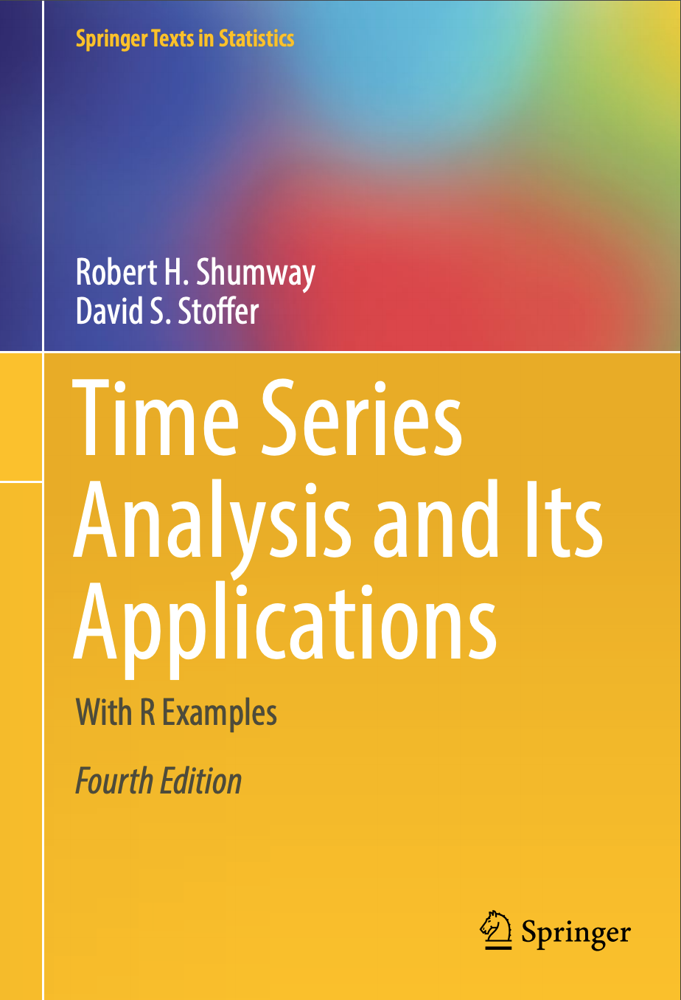

```{r setup, include=FALSE}
knitr::opts_chunk$set(echo = TRUE)
```

## What is Time?

> "You cannot think of eternity, Think of it like time, You try to think, You try to count, You just mess up your mind." --Willie Dixon

```{r echo=FALSE, out.width = '20%', fig.align = 'right'}

```

<br>
<br>
<br>

> "Time is what keeps everything from happening at once." -- Ray Cummings

```{r echo=FALSE, out.width = '25%', fig.align = 'right'}

```

<br>
<br>
<br>

> "I can tell your future, Look what's in your hand." --Robert Hunter

```{r echo=FALSE, out.width = '30%', fig.align = 'right'}
knitr::include_graphics("hunter.png")
```

<br>
<br>
<br>

> “It’s like linear regression using least squares, but it is much harder and the results are not explicit.” --David Stoffer

```{r echo=FALSE, out.width = '15%', fig.align = 'right'}

```

## Background to Time Series

Motivating questions:

- What is time series data?
- Why do we need time series models?

```{r echo=FALSE, fig.cap="Time series of the DJIA", out.width = '75%', fig.align = 'center'}
knitr::include_graphics("djia.png")
```


## Time Series

- What is time series data?
  - Sequences of measurements that follow a non-random order
  - Measurements are related (correlated) to each other and non-independent; e.g., a measurement at $t_2$ is related to a measurment at $t_1$, or, the conditions of the measure at $t_1$ will influence the measure at $t_2$
  
- Why do we need time series models?
  - We want to describe the time series phenomenon, forcast or predict the future, and need to account for error structure in the data
  - Many statistical tools, like the linear model, assume no auto-correlation or statistical independence of the errors, which is violated with time series data

**Time series: we regress today against yesterday**


## Some Time Series Terms
**trend** -- a general, systematic, and non-repeating change

**seasonality** -- repeated and systematic change over an interval

**smoothing** -- local averaging of data to help with errors and improve fitting

**autoregression** -- the need to regress observations against previous (lagged) observations

**autocorrelation** -- the preserved signal that generates similarity between observations and lagging observations


```{r echo=FALSE, fig.cap="", out.width = '50%', fig.align = 'center'}
knitr::include_graphics("keeling.png")
```

## ARIMA(*p*,*d*,*q*) models

ARIMA -- **A**uto**R**egressive **I**ntegrated **M**oving **A**verage models (also ARMA models)

Stationary assumption

1. Mean of the *ts* should be constant (not a function of time)
2. Variance of the *ts* should be constant (not a function of time)
3. Covariance of the *ts* should be constnt (not a function of time)

There are tests for stationarity and **differencing**, **transformations**, and other approaches to make non-stationary time series stationary.

## (*p*,*d*,*q*) ?

ARIMA models are typically accompanied by three numbers that are refered to as (*p*,*d*,*q*)

Each of these corresponds to part of the ARIMA model that will be explored in more detail.

- AR(*p*) where *p* indicates the order of the autoregressive term

- I(*d*) where *d* indicates the amount of differencing (if differencing)

- MA(*q*) where *q* indicates the order of the moving average

*If all three terms = 0, then you don't have a time series model. At least one of the AR or MA terms needs to be 1 as a minimum for a time series model.*


## AR(*p*)

- AutoRegressive refers to the serially-correlated measurements and the fact that the model estimates a coefficent(s) for this (lag) effect. 
- The notation *p* indicates the *order* or dimension of the autoregressive component
  - When *p*=0 there is no dependence and the process is often referred to as *white noise*
  - Typically *p*=1 is the minimal *p* for an ARMA model

Example AR(1)

$$X_t = \phi X_{t-1} + \epsilon_t$$

- $X_t$ is obervation at time $t$
- $\phi$ is the coefficient
- $X_{t-1}$ are the prior obervations
- $\epsilon$ common error component, in this case refered to as *white noise*

**Note that time series notation and equations is not straightforward to the novice, combined with the fact that it appears not to be very standardized. Although I always caution students to not code a model they could not also express in statistical notation, this seminar will not force the notation issue.**

## MA(*q*)

- Moving Average refers to the serially-correlated error and the fact that the model estimates a coefficent(s) for this (lag) effect. 
- The notation *q* indicates the order of the MA term
 
Example MA(1)
$$\epsilon_t = W_t + \theta W_{t-1}$$

## ARMA
When we combine the AR and MA models, we get an ARMA(1,1) model expressed as:

$$X_t = \phi X_{t-1} + W_t + \theta W_{t-1}$$

## Stationarity

**stationarity** -- mean is stable, correlation structure is contestant

- Stationarity is a very important aspect of the time series data you will model
- You need to know if your data are stationary or non-stationary before starting
- If your data are stationary, you can easily estimate mean and use that for understanding correlation; in other words, we can lag observations because we assume the underlying mean is not changing, and we can use different lags
- If your data are not stationary, you can *difference* ($x_t - x_{t1}$) and then model the differenced data (e.g., random walk)
- If your data are non-stationary and heteroscedastic suggest log transform to stabilize the variance and then difference to stabilize the trend
- Differencing adds the **I** to ARMA and makes it an ARIMA model; in other words, ARMA models are for data that are already stationary
- If the differenced data has ARMA properties, then continue with ARIMA

**ARMA for stationary data only**

```{r, echo=F}
set.seed(4)
rw <- arima.sim(model = list(order = c(0, 1, 0)), n=200)
rw <- rw + 5
plot(rw, las = 1, ylab = "Observations", main = "Random Walk")
plot(log(rw), las = 1, ylab = "Observations", main = "log(Random Walk)")
plot(diff(log(rw)), las = 1, ylab = "Observations", main = "diff(log(Random Walk))")
```

## Understanding the model orders
You cannot typically determine ARMA(*p*,*q*) structure visually, so you will need to diagnose, examine, and figure it out.

Auto-Correlation (ACF) and Partial Auto-Correlation are the diagostic tools used to identify model orders.

ACF displays the correlation between today and previous time points. ACF interprets MA order.

PACF displays the correlation between today and previous time points, but accounts for (and removes the effect of) past correlations. PACF is the "real" correlation because it controls for outside influences. PACF interprets AR order.

Although ACF and PACF display the correlations, there is still a bit of estimation and evaluation that you will need to consider.

This table will help interprect ACF anf PACF output. This table is taken from Schumway and Stoffer (20XX).

|      | AR(p)             | MA(q)             | ARMA(p,q) |
|------|-------------------|-------------------|-----------|
| ACF  | Tails off         | Cuts off at lag q | Tails off |
| PACF | Cuts off at lag p | Tails off         | Tails off |

**I think with time you will understand how to interpret tailing off and cutting off, but be aware that these are not technical terms and there is some subjectivity to their interpretation!**

Using simulated data, let's see some examples of ACF and PACF plots with known ARMA data.


```{r, echo=F}
library(astsa)
x <- arima.sim(model = list(order = c(1, 0, 0), ar = -.9), n = 100)
par(mfrow=c(1,2))
acf(x,main = "AR(1)")
pacf(x,main = "AR(1)")
```

The above plots were generated from simulated data for an AR(1) model. We can see that the ACF tails off and the PACF cuts off abruptly after 1. Based on the table above, our diagnostics describe an AR(*q*), where *q* = 1 as suggested by the cut off. 

```{r, echo=F}
x2 <- arima.sim(model = list(order = c(2, 0, 0), ar = c(1.5,-.9)), n = 100)
par(mfrow=c(1,2))
acf(x2,main = "AR(2)")
pacf(x2,main = "AR(2)")
```

These ACF and PACF plots were generated based on an AR(2) model You should be able ot tell that they fit the description in the table above to be an AR(*p*) model, but with 2 significant lag effects in the PACF, we can correctly assume that the AR order is 2. 

```{r, echo=F}
x3 <- arima.sim(model = list(order = c(0, 0, 1), ma = .5), n = 100)
par(mfrow=c(1,2))
acf(x3,main = "MA(1)")
pacf(x3,main = "MA(1)")
```

Here we see plots that show a cut off in the ACF after 1 and a PACF that appears to tail off. These characteristics suggest an MA(*q*) model, and the cutoff at 1in the ACF further points to an MA(1) model. 

```{r, echo=F}
x4 <- arima.sim(model = list(order = c(1, 0, 1), ar = -0.5, ma = 0.9), n = 100)
par(mfrow=c(1,2))
acf(x4,main = "ARMA(1,1)")
pacf(x4,main = "ARMA(1,1)")
```

Finally, these are diagnostic plots from an ARMA model. You might be able to tell that both appear to tail off. (If that is not clear, there are additional diagnostics that can be explored. Also, note that in this case and all the above examples, the data is simulated and different simulation runs may result in different diagnostic plots.)


## Model Selection and Diagnostics 

- Always good to go with the simpler model and add from there if needed
- Use AIC and BIC for model selection
- Look at fitted models and ‘significant’ parameters
- Check model residuals

```{r, echo=F}
mod <- arima.sim(model = list(order = c(1, 0, 0), ar = -.9), n = 100)
sarima(mod, 1,0,0)
```

The above is a typical set of plots that can be used to check model fit. In the top panel, the standardized residuals appear to center on 0 with asymptotic variance, which is what we want. The ACF of the residuals checks out of we see few to no residuals beyond the dashed blue lines. The Q-Q plot is interpreted as a typical Q-Q plot in linear diagnostics. Finally, the bottom panel is quickly interpreted as good when all (or nearly all) of the values are above the dashed blue line. 


