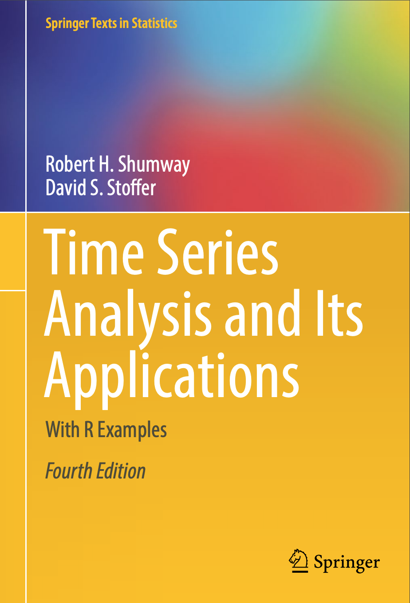
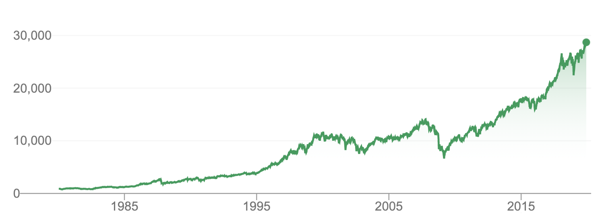
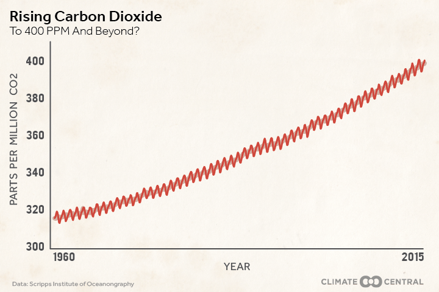
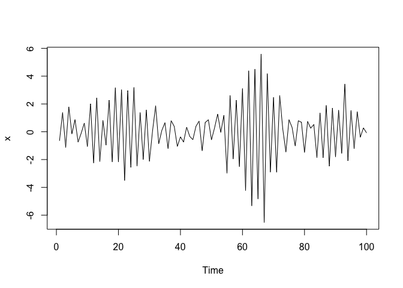

ARIMA Basics
================
Steve Midway
Spring 2020

## What is Time?

“You cannot think of eternity, Think of it like time, You try to think,
You try to count, You just mess up your
mind.”


“I can tell your future, Look what’s in your
hand.”


“It’s like linear regression using least squares, but it is much harder
and the results are not explicit”



## Background to Time Series

Motivating questions:

  - What is time series data?
  - Why do we need time series
models?



## Time Series

  - What is time series data?
      - Sequences of measurements that follow a non-random order
      - Measurements are related (correlated) to each other and
        non-independent; e.g., a measurement at
         is
        related to a measurment at
        , or, the
        conditions of the measure at
         will
        influence the measure at
        
      
      
  - Why do we need time series models?
      - We want to describe the time series phenomenon, forcast or
        predict the future, and need to account for error structure in
        the data
      - Many statistical tools, like the linear model, assume no
        auto-correlation or statistical independence of the errors,
        which is violated with time series data

*Time series: we regress today against yesterday*

## Some Time Series Terms

**trend** – a general, systematic, and non-repeating change

**seasonality** – repeated and systematic change over an interval

**smoothing** – local averaging of data to help with errors and improve
fitting

**autoregression** – the need to regress observations against previous
(lagged) observations

**autocorrelation** – the preserved signal that generates similarity
between observations and lagging
observations



## ARIMA(,,) models

ARIMA – **A**uto**R**egressive **I**ntegrated **M**oving **A**verage
models (also ARMA models)

Stationary assumption

1.  Mean of the ts should be constant (not a function of time)
2.  Variance of the ts should be constant (not a function of time)
3.  Covariance of the ts should be constnt (not a function of time)

There are tests for stationarity and *differencing*, *transformations*,
and other approaches to make non-stationary time series
stationary.

## (,,) ?

ARIMA models are typically accompanied by three numbers that are refered
to as (,,)

Each of these corresponds to part of the ARIMA model that will be
explored in more detail.

  - AR() where
     indicates the order
    of the autoregressive term

  - I() where
     indicates the
    amount of differencing (if differencing)

  - MA() where
     indicates the order
    of the moving average

*If all three terms = 0, then you don’t have a time series model. At
least one of the AR or MA terms needs to be 1 as a minimum for a time
series model.*

## AR()

  - AutoRegressive refers to the serially-correlated measurements and
    the fact that the model estimates a coefficent(s) for this (lag)
    effect.
  - The notation 
    indicates the *order* or dimension of the autoregressive component
      - When 
        there is no dependence and the process is often referred to as
        *white noise*
      - Typically  is the minimal
         for an ARMA
        model

## AR(*p*) notation

Example AR(3) notation

  
  

  -  is
    obervation at time 
  -  is the intercept
  - ,
    ,
     are the prior obervations
  - ,
    ,
     are the autoregressive coefficients (model parameters)
  -  common error component

## AR(*p*) examples

``` r
x <- arima.sim(model = list(ar = -0.9), n = 100)
plot.ts(x)
```

<!-- -->

## MA()

  - Moving Average refers to the serially-correlated error and the fact
    that the model estimates a coefficent(s) for this (lag) effect.
  - The notation 
    indicates the order of the MA
    term
  - <http://people.cs.pitt.edu/~milos/courses/cs3750/lectures/class16.pdf>
