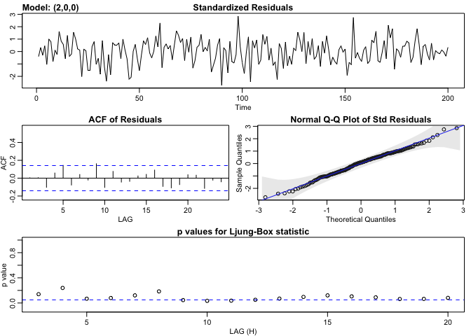
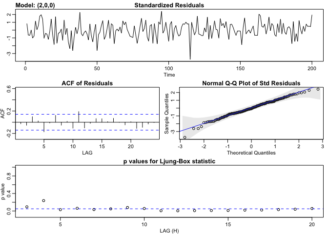

ARIMA Coding Tutorial
================
Steve Midway
Spring 2020

As with most things in R, there is a rich environments of packages and
functions beyond the basics presented here. This coding tutorial is not
intended to be comprehensive, but to simply serve as a way to get you
coding ARIMA models and understanding their mechanics. This document is
intended for you to work through. Much of the code is there, but much of
it will need to be built on.

### Libraries

``` r
library(astsa) # Applied Statistical Time Series Analysis
```

### Time Series Objects

When working with time series data in R, we typically want to have the
observations in a time series object, or `ts()`. For example, check out
the dataset `Nile`.

``` r
Nile
```

    ## Time Series:
    ## Start = 1871 
    ## End = 1970 
    ## Frequency = 1 
    ##   [1] 1120 1160  963 1210 1160 1160  813 1230 1370 1140  995  935 1110  994 1020
    ##  [16]  960 1180  799  958 1140 1100 1210 1150 1250 1260 1220 1030 1100  774  840
    ##  [31]  874  694  940  833  701  916  692 1020 1050  969  831  726  456  824  702
    ##  [46] 1120 1100  832  764  821  768  845  864  862  698  845  744  796 1040  759
    ##  [61]  781  865  845  944  984  897  822 1010  771  676  649  846  812  742  801
    ##  [76] 1040  860  874  848  890  744  749  838 1050  918  986  797  923  975  815
    ##  [91] 1020  906  901 1170  912  746  919  718  714  740

`Nile` is small dataset of annual flow of the Nile River (for more
details, see `?Nile`). For our purposes, you can see here that `Nile` is
listed as a Time Series object, and that can be further supported with
the command `class(Nile)`, where `ts` means time series. You can
certainly use data that are not a time series object, but there may be
benefits to having data as a time series object and learning the
capabailities of the time series object. For example, if we simply plot
the `Nile` object, it will render as we expect (which is not necessarily
the same as if the data were just a vector.)

``` r
plot(Nile, las=1)
```

<!-- -->

You may also want to convert your data to a time series object, which is
accomplished by wrapping your data in `ts()`. It might be good to
quickly read up on `ts` objects as they can be very useful for time
series data.

### Basic Time Series Example

Let’s stick with the `Nile` data to get a feel for some basic functions
we may want to use with a time series object.

We may want to see the PACF and ACF plots. The `astsa::acf2` function
will help us with this. Note that there are other packages and functions
for producing these plots, but I will share some functions from the
`astsa` package here.

``` r
acf2(Nile)
```

<!-- -->

    ##        ACF  PACF
    ##  [1,] 0.50  0.50
    ##  [2,] 0.38  0.18
    ##  [3,] 0.33  0.11
    ##  [4,] 0.24  0.01
    ##  [5,] 0.23  0.07
    ##  [6,] 0.23  0.07
    ##  [7,] 0.22  0.06
    ##  [8,] 0.30  0.16
    ##  [9,] 0.14 -0.15
    ## [10,] 0.09 -0.06
    ## [11,] 0.22  0.19
    ## [12,] 0.21  0.09
    ## [13,] 0.24  0.06
    ## [14,] 0.19 -0.05
    ## [15,] 0.15 -0.03
    ## [16,] 0.19  0.07
    ## [17,] 0.14  0.02
    ## [18,] 0.19  0.12
    ## [19,] 0.15 -0.12
    ## [20,] 0.11 -0.06

We might guess that with the ACF tailing off and the PACF cutting off at
1, that the an MA(1) model would be a good place to start. Let’s try it.
We can use `astsa::sarima` for the model fitting; this function is good
for ARIMA fitting and produces useful diagnostic plots with the model
output.

``` r
sarima(Nile, p = 0, d = 0, q = 1)
```

    ## initial  value 5.126219 
    ## iter   2 value 5.039815
    ## iter   3 value 5.028709
    ## iter   4 value 5.027886
    ## iter   5 value 5.027870
    ## iter   5 value 5.027870
    ## iter   5 value 5.027870
    ## final  value 5.027870 
    ## converged
    ## initial  value 5.028277 
    ## iter   2 value 5.028272
    ## iter   3 value 5.028270
    ## iter   3 value 5.028270
    ## iter   3 value 5.028270
    ## final  value 5.028270 
    ## converged

<!-- -->

    ## $fit
    ## 
    ## Call:
    ## stats::arima(x = xdata, order = c(p, d, q), seasonal = list(order = c(P, D, 
    ##     Q), period = S), xreg = xmean, include.mean = FALSE, transform.pars = trans, 
    ##     fixed = fixed, optim.control = list(trace = trc, REPORT = 1, reltol = tol))
    ## 
    ## Coefficients:
    ##          ma1     xmean
    ##       0.3783  919.2433
    ## s.e.  0.0791   20.9685
    ## 
    ## sigma^2 estimated as 23272:  log likelihood = -644.72,  aic = 1295.44
    ## 
    ## $degrees_of_freedom
    ## [1] 98
    ## 
    ## $ttable
    ##       Estimate      SE t.value p.value
    ## ma1     0.3783  0.0791  4.7818       0
    ## xmean 919.2433 20.9685 43.8392       0
    ## 
    ## $AIC
    ## [1] 12.95442
    ## 
    ## $AICc
    ## [1] 12.95565
    ## 
    ## $BIC
    ## [1] 13.03257

This is not a good fit. Some of the diagnostics look ok, but the
Ljung-Box statistic is not acceptable (we want nearly all or all of the
points above the blue line). What are some things we can try to have a
more confident model fit?

### Simulating and Recovering Estimates

A powerful appraoch to understanding models is to know the data you are
putting into them. Then, if a model returns your known data (in the form
of estimates), you can build confidence in how the model operates. If
the model does not return what you expect based on the data you used,
then you know that it will take some effort to diagnose what is
happening that is not yet understood (which could be a model
misspecification, a changing of scales, etc.). Let’s use the function
`arima.sim()` to simulate some data sets with known characteristics that
we can then attempt to recover by modeling. You may want to review the
help page for `arima.sim`, although it is pretty straightforward.

Let’s start with an AR(2) model and simulate some data for it. After you
simulate this data, feel free to pause, evaluate the object you have
created, and get comfortable with it. Note that in the function, you
need to include the correct number of coefficients to match the order.
In the example below, I specificed an AR(2), so I need two coefficients
(i.e., `ar = c(1.5,
-0.75)`).

``` r
x.ar2 <- arima.sim(model = list(order = c(2, 0, 0), ar = c(1.5, -0.75)), n = 200)
```

Now let’s plot our data.

``` r
plot(x.ar2)
```

<!-- -->

Next we might want to see some correlation plots.

``` r
acf2(x.ar2)
```

<!-- -->

    ##         ACF  PACF
    ##  [1,]  0.86  0.86
    ##  [2,]  0.53 -0.78
    ##  [3,]  0.14 -0.02
    ##  [4,] -0.20  0.00
    ##  [5,] -0.42 -0.01
    ##  [6,] -0.50 -0.04
    ##  [7,] -0.45 -0.06
    ##  [8,] -0.31  0.04
    ##  [9,] -0.13 -0.03
    ## [10,]  0.03 -0.01
    ## [11,]  0.15  0.02
    ## [12,]  0.22  0.08
    ## [13,]  0.25  0.10
    ## [14,]  0.25  0.03
    ## [15,]  0.21 -0.08
    ## [16,]  0.13 -0.07
    ## [17,]  0.02 -0.04
    ## [18,] -0.10  0.03
    ## [19,] -0.21 -0.04
    ## [20,] -0.28 -0.11
    ## [21,] -0.30 -0.05
    ## [22,] -0.27 -0.01
    ## [23,] -0.21 -0.12
    ## [24,] -0.11  0.08
    ## [25,]  0.00 -0.05

Hopefully you can start to see how this data might be AR(2) (ignoring
the fact that you know it was randomly generated to characterize AR(2)
data\!). Now we can simply fit an AR(2) model and see what the model
fits look like.

``` r
sarima(x.ar2, p = 2, d = 0, q = 0)
```

    ## initial  value 1.224650 
    ## iter   2 value 1.093224
    ## iter   3 value 0.655450
    ## iter   4 value 0.410282
    ## iter   5 value 0.196859
    ## iter   6 value 0.039143
    ## iter   7 value 0.019996
    ## iter   8 value 0.001533
    ## iter   9 value 0.001500
    ## iter  10 value 0.001441
    ## iter  11 value 0.001404
    ## iter  12 value 0.001394
    ## iter  13 value 0.001394
    ## iter  14 value 0.001394
    ## iter  14 value 0.001394
    ## iter  14 value 0.001394
    ## final  value 0.001394 
    ## converged
    ## initial  value 0.024729 
    ## iter   2 value 0.024310
    ## iter   3 value 0.024088
    ## iter   4 value 0.024014
    ## iter   5 value 0.024014
    ## iter   6 value 0.024014
    ## iter   7 value 0.024014
    ## iter   7 value 0.024014
    ## iter   7 value 0.024014
    ## final  value 0.024014 
    ## converged

<!-- -->

    ## $fit
    ## 
    ## Call:
    ## stats::arima(x = xdata, order = c(p, d, q), seasonal = list(order = c(P, D, 
    ##     Q), period = S), xreg = xmean, include.mean = FALSE, transform.pars = trans, 
    ##     fixed = fixed, optim.control = list(trace = trc, REPORT = 1, reltol = tol))
    ## 
    ## Coefficients:
    ##          ar1      ar2   xmean
    ##       1.5669  -0.8215  0.3137
    ## s.e.  0.0413   0.0411  0.2825
    ## 
    ## sigma^2 estimated as 1.031:  log likelihood = -288.59,  aic = 585.18
    ## 
    ## $degrees_of_freedom
    ## [1] 197
    ## 
    ## $ttable
    ##       Estimate     SE  t.value p.value
    ## ar1     1.5669 0.0413  37.9617  0.0000
    ## ar2    -0.8215 0.0411 -19.9741  0.0000
    ## xmean   0.3137 0.2825   1.1103  0.2682
    ## 
    ## $AIC
    ## [1] 2.925904
    ## 
    ## $AICc
    ## [1] 2.926517
    ## 
    ## $BIC
    ## [1] 2.991871

Looks good\! Prentend that you really didn’t know the model order and
the correlation plots were not that helpful. Noodle around with some
other lower order ARMA models and see how the fits vary.

For the next part, repeat the structure of the exercise above (i.e.,
simulate data and then fit models to recover the estimates), but do so
with an MA(1) model. This should be just as simple as the AR example
above, but in this case, experiment with the coefficient, which can be
either positive or negative, and of different magnitudes. How well does
the model recover the coefficient? How does changing sample size effect
the coefficient estimate? (Note that with increasing ARMA model
complexity, some combinations of coefficients will not work and will
result in warnings or errors. You won’t likely encounter that in a
simple model with one coefficient, but it may eventually happen as your
models grow.)

### Forecasting

The `astsa` package has a nice function for forcasting, which is another
important area of time series models. The function `sarima.for()`
handles forecasting. Let’s go back to our AR(2) data and model (in `ts`
object `x`) and see what it does in a forecast. The `n.ahead =`
arguement is where you specify how many time points you want forecasted.

``` r
sarima.for(xdata = x.ar2, n.ahead = 3, p = 2, d = 0, q = 0)
```

<!-- -->

    ## $pred
    ## Time Series:
    ## Start = 201 
    ## End = 203 
    ## Frequency = 1 
    ## [1] 2.233822 3.133827 3.155114
    ## 
    ## $se
    ## Time Series:
    ## Start = 201 
    ## End = 203 
    ## Frequency = 1 
    ## [1] 1.015143 1.886926 2.512073

Play around with the number of forecasted points. What happens as you
increase it? If you have different data (in either model order and/or
coefficients), does the forecasting and associated forecast uncertainty
change?

### Model Selection

You will likely want to use AIC (or comparable) for selecting ARIMA
model orders. This can be done manually by fitting candidate models and
comparing AICs. However, you might prefer an automated version of this
information. The function `ar()` (in the built-in `stats` package) does
this for AR models, but I am not sure how MA components are handled.
Another option is to try `forecast::auto.arima`. Let’s simulate some
data and then see how well model selection performs. (Don’t be afraid to
read the help file on `auto.arima` as there is a lot of fine tuning you
can do.)

``` r
# Generate some data
x.ms <- arima.sim(model = list(order = c(0, 0, 2), ma = c(1.5, -0.75)), n = 200)

# Model selection
library(forecast)
auto.arima(x.ms)
```

    ## Series: x.ms 
    ## ARIMA(0,0,2) with zero mean 
    ## 
    ## Coefficients:
    ##          ma1      ma2
    ##       0.0434  -0.2698
    ## s.e.  0.0670   0.0628
    ## 
    ## sigma^2 estimated as 3.99:  log likelihood=-421.24
    ## AIC=848.48   AICc=848.61   BIC=858.38

Feel free to change the simulated data and see how the model selection
works on models of different complexity. You might notice that the
`auto.arima` function tends to select more complex models than you know
to be true (based on the data generation). On one hand, it could be that
a more complex model fits the data better than the parameters under
which the data were generated. Also, it could be that AIC is tending
toward more complex models. I do not know enough about AIC applied to
time series data to be sure, but AIC in other applications can often
tend toward the more complex side of the possible models. What can you
modify in the `auto.arima` function to limit model complexity? What
model order was selected for the `Nile` dataset?

### Coefficients

The last thing that we will play with in time series models is adding
coefficients. For most time series models, the primary independent
variable of interest is *time*. So for many time series models you may
only want to model the effect of time. But there will likely be cases
where you want to quantify the effect of some other indepednent variable
along with time. Let’s simulate some ARMA data and then a correlated and
uncorrelated covariate to understand how to include covariates,

``` r
# Generate some data
x.cor <- arima.sim(model = list(order = c(2, 0, 0), ar = c(1.5, -0.75)), n = 200)

# Correlated covariate
cov1 <- (x.cor * 1.5) + rnorm(n = length(x.cor))
# plot(x.cor ~ cov1) # Check relationship

# Uncorrelated covariate (cov2)
cov2 <- runif(n = length(x.cor),min = 0, max = 10)
# plot(x.cor ~ cov2) # Check relationship
```

Now let’s run the ARIMA models and see what we recover. First the
regression with the correlated predictor

``` r
# ARIMA model with correlated covariate
sarima(x.cor, p = 2, d = 0, q = 0, xreg = cov1)
```

    ## initial  value -0.377764 
    ## iter   2 value -0.384479
    ## iter   3 value -0.386940
    ## iter   4 value -0.390865
    ## iter   5 value -0.391270
    ## iter   6 value -0.391292
    ## iter   7 value -0.391293
    ## iter   8 value -0.391293
    ## iter   9 value -0.391294
    ## iter  10 value -0.391294
    ## iter  10 value -0.391294
    ## final  value -0.391294 
    ## converged
    ## initial  value -0.390338 
    ## iter   2 value -0.390368
    ## iter   3 value -0.390417
    ## iter   4 value -0.390422
    ## iter   5 value -0.390426
    ## iter   6 value -0.390430
    ## iter   7 value -0.390432
    ## iter   8 value -0.390432
    ## iter   9 value -0.390432
    ## iter   9 value -0.390432
    ## iter   9 value -0.390432
    ## final  value -0.390432 
    ## converged

<!-- -->

    ## $fit
    ## 
    ## Call:
    ## stats::arima(x = xdata, order = c(p, d, q), seasonal = list(order = c(P, D, 
    ##     Q), period = S), xreg = xreg, transform.pars = trans, fixed = fixed, optim.control = list(trace = trc, 
    ##     REPORT = 1, reltol = tol))
    ## 
    ## Coefficients:
    ##          ar1     ar2  intercept    xreg
    ##       0.1983  0.1051     0.0013  0.5778
    ## s.e.  0.1030  0.0800     0.0688  0.0252
    ## 
    ## sigma^2 estimated as 0.4578:  log likelihood = -205.7,  aic = 421.4
    ## 
    ## $degrees_of_freedom
    ## [1] 196
    ## 
    ## $ttable
    ##           Estimate     SE t.value p.value
    ## ar1         0.1983 0.1030  1.9255  0.0556
    ## ar2         0.1051 0.0800  1.3132  0.1906
    ## intercept   0.0013 0.0688  0.0189  0.9850
    ## xreg        0.5778 0.0252 22.9519  0.0000
    ## 
    ## $AIC
    ## [1] 2.107013
    ## 
    ## $AICc
    ## [1] 2.108038
    ## 
    ## $BIC
    ## [1] 2.189471

The *p*-value on `xreg` is reported as 0, suggesting that `cov1`
provides a significant effect, which is esimated to be 0.604.

Now with the uncorrelated predictor.

``` r
# ARIMA model with uncorrelated covariate
sarima(x.cor, p = 2, d = 0, q = 0, xreg = cov2)
```

    ## initial  value 0.886427 
    ## iter   2 value 0.742974
    ## iter   3 value 0.367748
    ## iter   4 value 0.169141
    ## iter   5 value 0.062284
    ## iter   6 value -0.009353
    ## iter   7 value -0.028670
    ## iter   8 value -0.033882
    ## iter   9 value -0.036551
    ## iter  10 value -0.036563
    ## iter  11 value -0.036564
    ## iter  12 value -0.036570
    ## iter  13 value -0.036571
    ## iter  14 value -0.036573
    ## iter  15 value -0.036573
    ## iter  15 value -0.036573
    ## iter  15 value -0.036573
    ## final  value -0.036573 
    ## converged
    ## initial  value -0.029100 
    ## iter   2 value -0.029104
    ## iter   3 value -0.029110
    ## iter   4 value -0.029118
    ## iter   5 value -0.029119
    ## iter   6 value -0.029120
    ## iter   7 value -0.029120
    ## iter   8 value -0.029120
    ## iter   8 value -0.029120
    ## iter   8 value -0.029120
    ## final  value -0.029120 
    ## converged

<!-- -->

    ## $fit
    ## 
    ## Call:
    ## stats::arima(x = xdata, order = c(p, d, q), seasonal = list(order = c(P, D, 
    ##     Q), period = S), xreg = xreg, transform.pars = trans, fixed = fixed, optim.control = list(trace = trc, 
    ##     REPORT = 1, reltol = tol))
    ## 
    ## Coefficients:
    ##          ar1      ar2  intercept    xreg
    ##       1.4086  -0.6891     0.1727  0.0031
    ## s.e.  0.0509   0.0508     0.2526  0.0142
    ## 
    ## sigma^2 estimated as 0.9318:  log likelihood = -277.96,  aic = 565.93
    ## 
    ## $degrees_of_freedom
    ## [1] 196
    ## 
    ## $ttable
    ##           Estimate     SE  t.value p.value
    ## ar1         1.4086 0.0509  27.6867  0.0000
    ## ar2        -0.6891 0.0508 -13.5537  0.0000
    ## intercept   0.1727 0.2526   0.6838  0.4949
    ## xreg        0.0031 0.0142   0.2194  0.8265
    ## 
    ## $AIC
    ## [1] 2.829638
    ## 
    ## $AICc
    ## [1] 2.830663
    ## 
    ## $BIC
    ## [1] 2.912096

The *p*-value on `xreg` is large, suggesting that `cov2` provides no
real effect, which is esimated to be 0.0063.

I strongly suggest you consider more information than simply *p*-values
when considering what covariates to include in your model and when
assessing their performance; however, for the purposes of this tutorial,
they illustrate the points we are trying to make about understanding if
correlated and uncorrelated predictors are doing what we expect in a
model.

### Alternative Functions

As we have mentioned, there are many time series-related functions and
many options for coding an ARIMA model. We have used functions from the
`astsa` package here, but recall that in the `stats` library there are
time series functions. Finally, although I am not sure about the
limitations of this approach, you can use the `nlme::gls` function,
which is for generalized least squares estimation, in which you can
modify the `correlation =` argument to specify for an ARMA model.

To illustrate, return to the `Nile` data set. If we want to model the
annual river flow simply as a function of time, we code the model in
what looks like an “intercept-only” formula, `y ~ 1`. Then, we would
need to know the ARMA structure, but if we suppose that it is an AR(1)
model, we might code it as below. How does this approach compare to
other functions you have tried?

``` r
library(nlme) # Needed for gls()
gls.ts <- gls(Nile ~ 1, correlation = corARMA(value = 0.25, p = 1))
summary(gls.ts)
```

    ## Generalized least squares fit by REML
    ##   Model: Nile ~ 1 
    ##   Data: NULL 
    ##        AIC      BIC    logLik
    ##   1277.287 1285.072 -635.6433
    ## 
    ## Correlation Structure: AR(1)
    ##  Formula: ~1 
    ##  Parameter estimate(s):
    ##       Phi 
    ## 0.5217584 
    ## 
    ## Coefficients:
    ##                Value Std.Error  t-value p-value
    ## (Intercept) 919.5774  30.21808 30.43136       0
    ## 
    ## Standardized residuals:
    ##        Min         Q1        Med         Q3        Max 
    ## -2.7071815 -0.7070632 -0.1522859  0.6594409  2.6303604 
    ## 
    ## Residual standard error: 171.2399 
    ## Degrees of freedom: 100 total; 99 residual
