COVID-19 Cases in Louisiana Parishes
================
Steve Midway
April 10, 2020

The models below fit logistic growth of COVID-19 cases to individual
parishes in Louisiana. Please note the following:

1.  The models, results, and inferences are completely exploratory and
    should **not** be used for decision making.

2.  All data comes directly from the [Louisiana Department of
    Health](http://ldh.la.gov/coronavirus/)

3.  The model used in each parish is a **logstic growth model**, which
    is not necessarily the best for this data, but is a commonly applied
    model.

4.  Several parishes are not included due to low numbers or numbers that
    do not fit into a logistic growth model. Parishes may be added as
    updated numbers are made available.

5.  The models make **no assumptions about human behavior** (for
    example, social distancing); they simply model the number of
    cumulative cases over time.

6.  The colors used for each parish represent the estimate of how close
    the most recent number of confirmed cases is to the expeected total
    number of confirmed cases. In other words, if the most recent number
    of confirmed cases is close to the expected total, the colors are
    lighter (yellow), whereas the colors get darker for parishes that
    have longer to go before the expected total.

7.  Questions or comments? [Email Steve
Midway](mailto:smidway@lsu.edu)

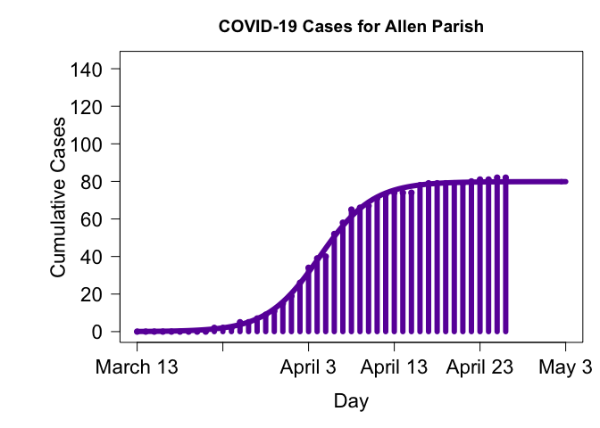<!-- -->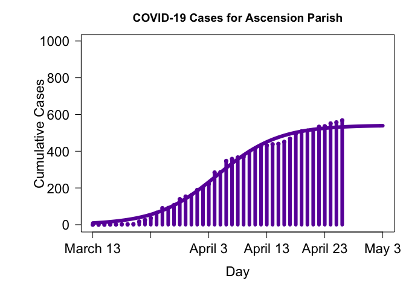<!-- --><!-- -->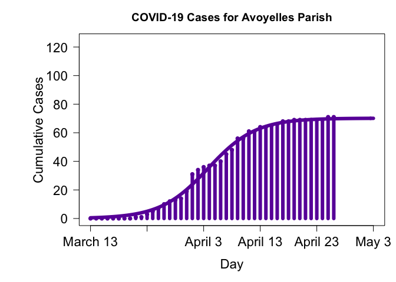<!-- --><!-- --><!-- --><!-- -->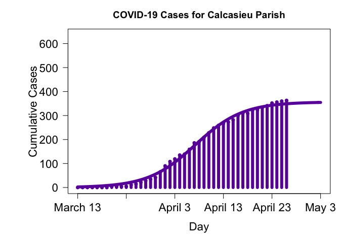<!-- -->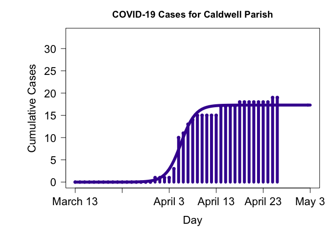<!-- -->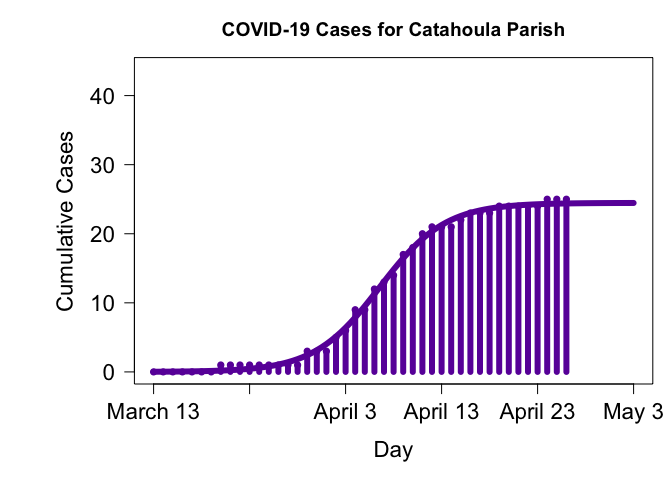<!-- -->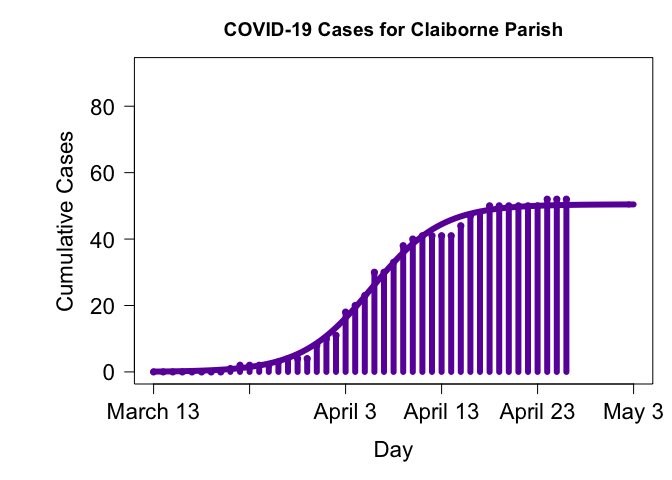<!-- -->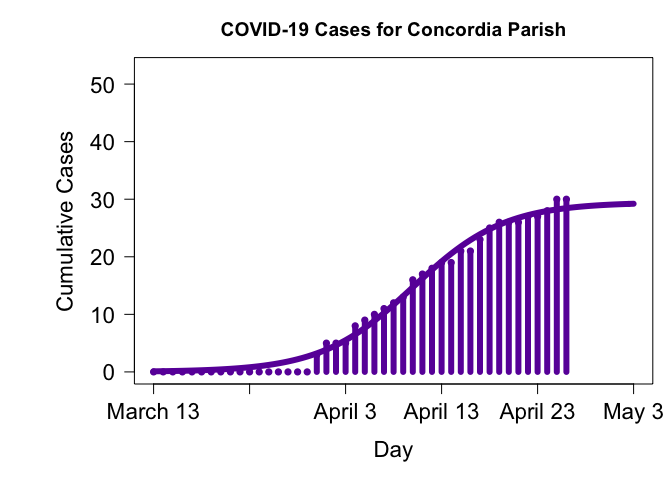<!-- -->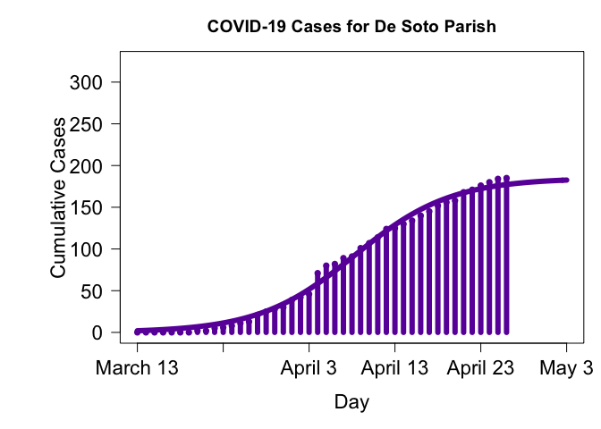<!-- --><!-- --><!-- -->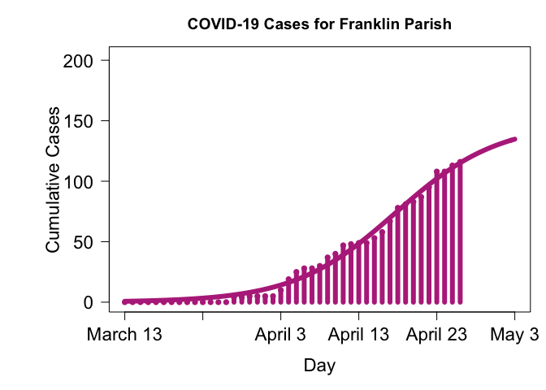<!-- --><!-- --><!-- --><!-- -->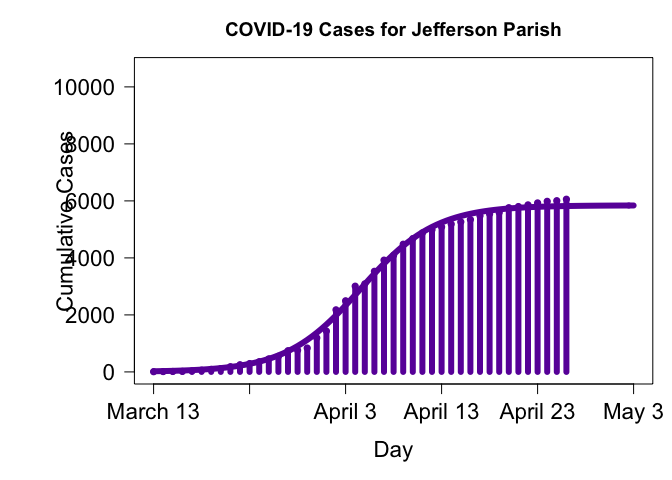<!-- -->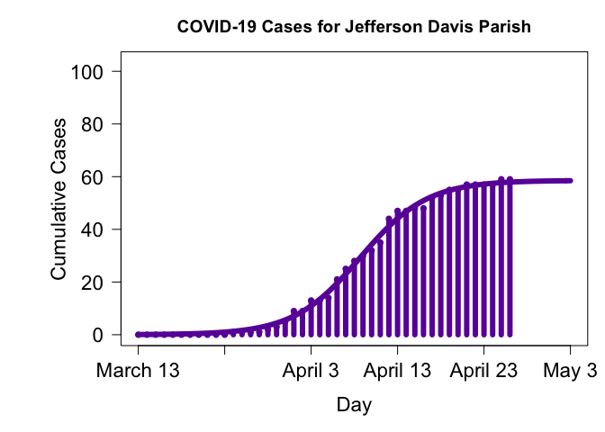<!-- -->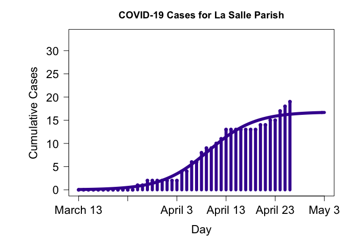<!-- -->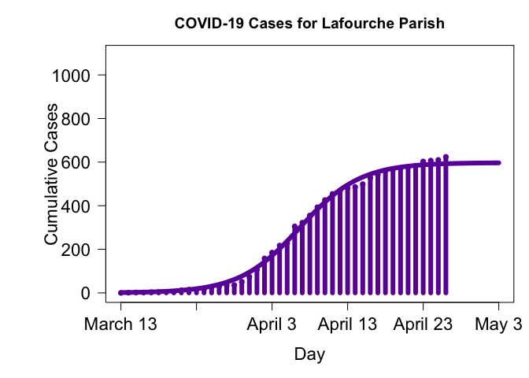<!-- --><!-- --><!-- -->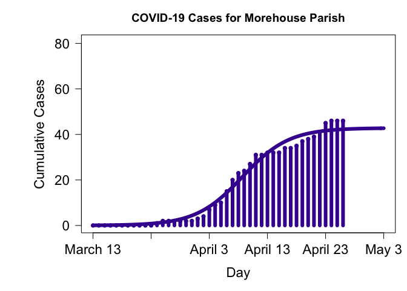<!-- -->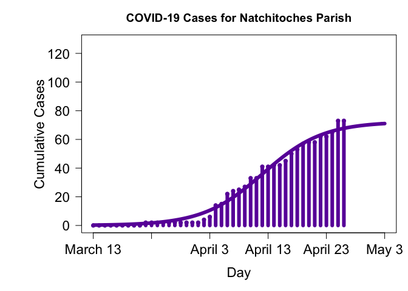<!-- -->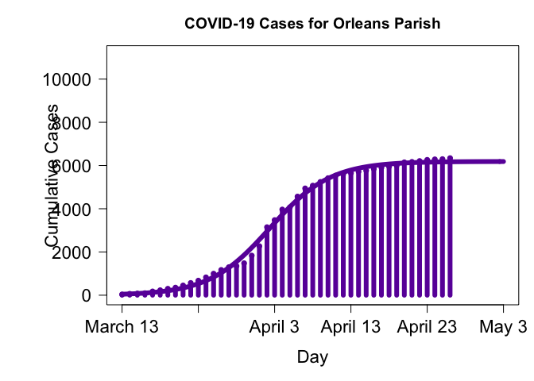<!-- --><!-- --><!-- --><!-- --><!-- -->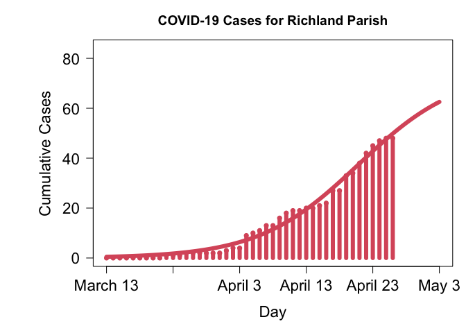<!-- -->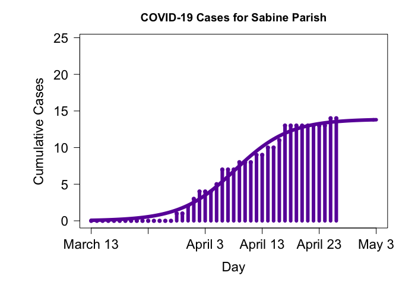<!-- --><!-- -->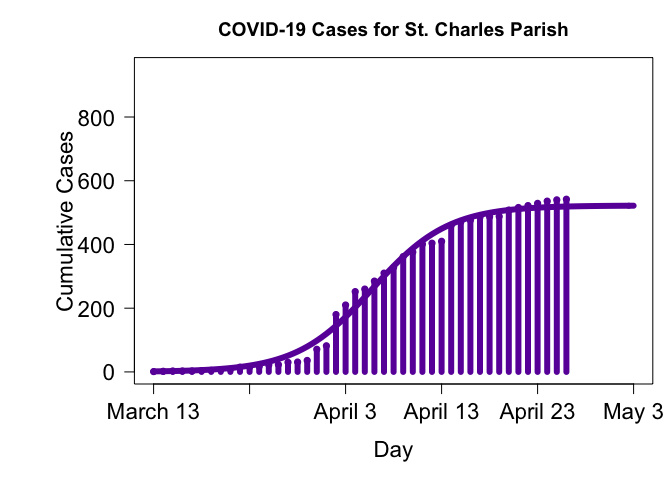<!-- --><!-- -->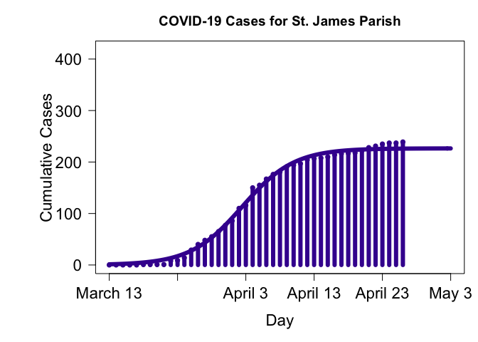<!-- --><!-- --><!-- --><!-- -->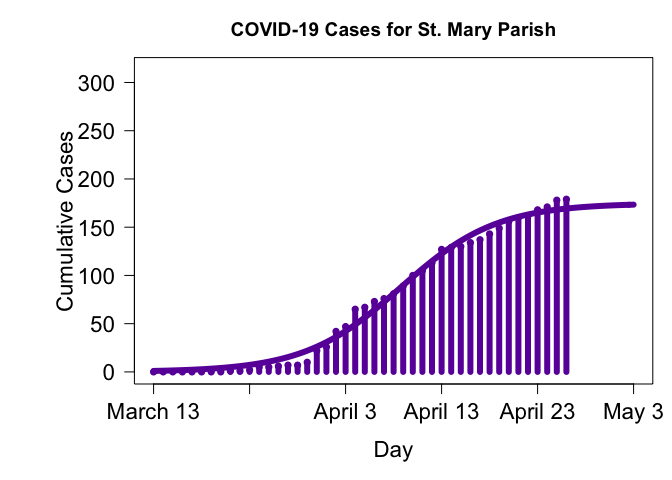<!-- -->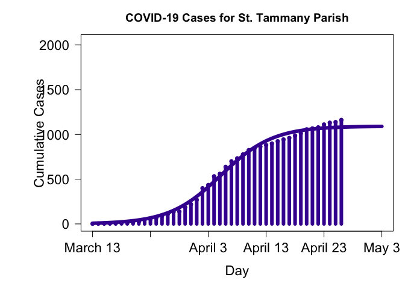<!-- --><!-- -->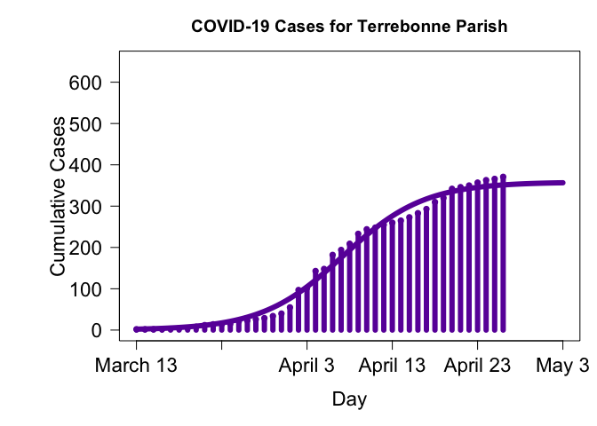<!-- --><!-- -->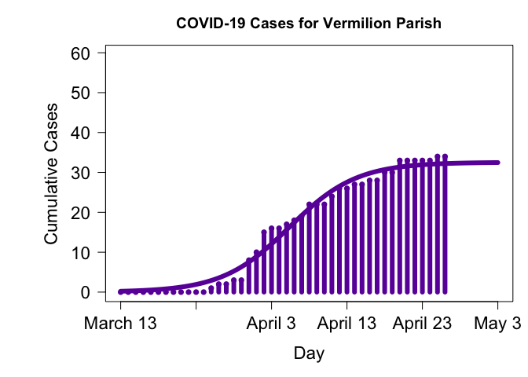<!-- --><!-- --><!-- -->
