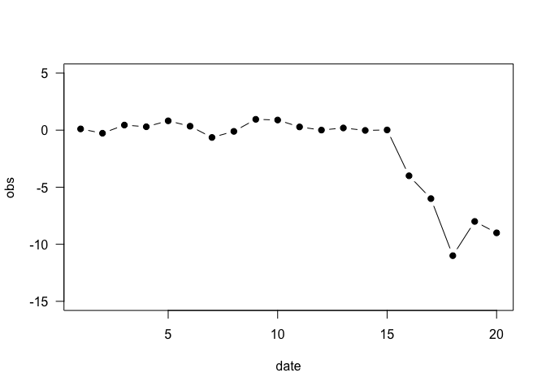
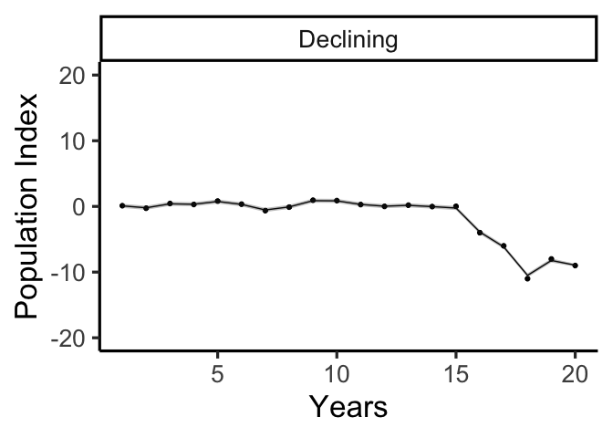

DLM Coding Tutorial
================
Steve Midway
Spring 2020

*Note that this tutorial was developed from code previously written by
Kenneth Erickson.*

### Libraries

Dynamic Linear Models (DLMs) can be fit using a number of different R
packages, although `MARSS` and `DLM` are the two dominant packages.

``` r
library(MARSS) # Multivariate Autoregressive State-Space Modeling
library(dlm) # Dynamic Linear Models
```

### Simulate Some Data

Let’s create a data set that has some obvious trends of dynamics that we
want to see our models capture. Please work with this simulated data,
but also come back to this step and simulate data with different
characteristics to explore. To start, let’s simulate a data set of 20
observations where the first 15 values are stable and then decline near
the end of the series.

``` r
library(data.table)
set.seed(4)
obs <- c(rnorm(15, 0, 0.5), -4, -6, -11, -8, -9)
date <- 1:20
sim.df <- data.table(date, obs)
```

And let’s make sure it looks like what we think we coded.

``` r
plot(obs ~ date, 
     data = sim.df,
     ylim = c(-15,5),
     pch = 19,
     type = 'b',
     las = 1)
```

<!-- -->

### MARSS Model

The most simple DLM is a stochastic level model, where the level is a
random walk without drift, and this level is observed with error. We
will write it first in using regression notation where the intercept is
alpha and then in MARSS notation. First we need to convert our dataframe
to a matrix, and then bundle some MARSS model components together that
will go into the model. The matrices in `mod_list` are all matrices that
MARSS models require and the creation of them below represents their
most basic form (i.e., these matrices can be modified for more complex
models). You are encouraged to read more about these matrices and what
they do (`?MARSS.marxss`), but details about them go beyond what we will
cover.

``` r
marss.dat <- as.matrix(sim.df) # Convert data frames to matrices for model

mod_list <- list(B = "identity", U = "zero", Q = matrix("q"),
                 Z = "identity", A = matrix("a"), R = matrix("r"))
```

Next, we will actually fit our MARSS model. Using the function
`MARSS()`, we will feed in the data, which include just the transposed
vector of observations, and the pre-packaged list of matrices that MARSS
requires.

``` r
marss.fit <- MARSS(t(marss.dat[,-1]), mod_list)
```

    ## Success! abstol and log-log tests passed at 47 iterations.
    ## Alert: conv.test.slope.tol is 0.5.
    ## Test with smaller values (<0.1) to ensure convergence.
    ## 
    ## MARSS fit is
    ## Estimation method: kem 
    ## Convergence test: conv.test.slope.tol = 0.5, abstol = 0.001
    ## Estimation converged in 47 iterations. 
    ## Log-likelihood: -39.26239 
    ## AIC: 86.52477   AICc: 89.19144   
    ##  
    ##       Estimate
    ## A.a   -0.00164
    ## R.r    0.19860
    ## Q.q    2.62062
    ## x0.x0  0.08783
    ## Initial states (x0) defined at t=0
    ## 
    ## Standard errors have not been calculated. 
    ## Use MARSSparamCIs to compute CIs and bias estimates.

It looks like the model is fit and has converged. The primary output we
get are estimates for the matrices that handle the model fitting. You
can index the `marss.fit` object for a number of things that you may
want to access, including the fitted values (`states`), the standard
error of the states (`states.se`) and the matrix coefficients (`coef`).

Next, we may want to see a visual of our model estimation.

``` r
library(broom)
library(ggplot2)
marss_plot.d <- augment(marss.fit, interval="confidence")
marss_plot <- ggplot(data = marss_plot.d) +
  geom_line(aes(t, .fitted)) +
  geom_point(aes(t, y)) + ylim(-20,20) +
  geom_ribbon(aes(x=t, ymin=.conf.low, ymax=.conf.up), linetype=2, alpha=0.5) +
  facet_grid(~"Declining") + 
  theme_classic() +
  xlab("Years") + ylab("Population Index")

marss_plot
```

<!-- -->
