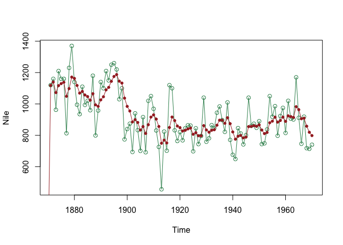

DLM Coding Tutorial
================
Steve Midway
Spring 2020

*Note that this tutorial was developed from code previously written by
Kenneth Erickson.*

### Libraries

Dynamic Linear Models (DLMs) can be fit using a number of different R
packages, although `MARSS` and `DLM` are the two dominant packages.

``` r
library(MARSS) # Multivariate Autoregressive State-Space Modeling
library(dlm) # Dynamic Linear Models
```

### Simulate Some Data

Let’s create a data set that has some obvious trends of dynamics that we
want to see our models capture. Please work with this simulated data,
but also come back to this step and simulate data with different
characteristics to explore. To start, let’s simulate a data set of 20
observations where the first 15 values are stable and then decline near
the end of the series.

``` r
library(data.table)
set.seed(4)
obs <- c(rnorm(15, 0, 0.5), -4, -6, -11, -8, -9)
date <- 1:20
sim.df <- data.table(date, obs)
```

And let’s make sure it looks like what we think we
coded.

``` r
plot(obs ~ date, data = sim.df,ylim = c(-15,5),pch = 19,type = 'b',las = 1)
```

<!-- -->

### `MARSS` Model

The most simple DLM is a stochastic level model, where the level is a
random walk without drift, and this level is observed with error. We
will write it first in using regression notation where the intercept is
alpha and then in MARSS notation. First we need to convert our dataframe
to a matrix, and then bundle some MARSS model components together that
will go into the model. The matrices in `mod_list` are all matrices that
MARSS models require and the creation of them below represents their
most basic form (i.e., these matrices can be modified for more complex
models). The **B**, **U**, and **Q** matrices are for the state-process
parameters. **Z** and **a** are not always required, but used with data
that includes multiple observations of the state processes. **R** is a
matrix for the correlation structure. You are encouraged to read more
about these matrices and what they do (`?MARSS.marxss`), but details
about them go beyond what we will
cover.

``` r
marss.dat <- as.matrix(sim.df) # Convert data frames to matrices for model

mod_list <- list(B = "identity", U = "zero", Q = matrix("q"),
                 Z = "identity", A = matrix("a"), R = matrix("r"))
```

Next, we will actually fit our MARSS model. Using the function
`MARSS()`, we will feed in the data, which include just the transposed
vector of observations, and the pre-packaged list of matrices that MARSS
requires.

``` r
marss.fit <- MARSS(t(marss.dat[,-1]), mod_list)
```

    ## Success! abstol and log-log tests passed at 47 iterations.
    ## Alert: conv.test.slope.tol is 0.5.
    ## Test with smaller values (<0.1) to ensure convergence.
    ## 
    ## MARSS fit is
    ## Estimation method: kem 
    ## Convergence test: conv.test.slope.tol = 0.5, abstol = 0.001
    ## Estimation converged in 47 iterations. 
    ## Log-likelihood: -39.26239 
    ## AIC: 86.52477   AICc: 89.19144   
    ##  
    ##       Estimate
    ## A.a   -0.00164
    ## R.r    0.19860
    ## Q.q    2.62062
    ## x0.x0  0.08783
    ## Initial states (x0) defined at t=0
    ## 
    ## Standard errors have not been calculated. 
    ## Use MARSSparamCIs to compute CIs and bias estimates.

It looks like the model is fit and has converged. The primary output we
get are estimates for the matrices that handle the model fitting. You
can index the `marss.fit` object for a number of things that you may
want to access, including the fitted values (`states`), the standard
error of the states (`states.se`) and the matrix coefficients (`coef`).

Next, we may want to see a visual of our model estimation.

``` r
library(broom)
library(ggplot2)
```

    ## 
    ## Attaching package: 'ggplot2'

    ## The following object is masked from 'package:dlm':
    ## 
    ##     %+%

``` r
marss_plot.d <- augment(marss.fit, interval="confidence")
marss_plot <- ggplot(data = marss_plot.d) +
  geom_line(aes(t, .fitted)) +
  geom_point(aes(t, y)) + ylim(-20,20) +
  geom_ribbon(aes(x=t, ymin=.conf.low, ymax=.conf.up), linetype=2, alpha=0.3) +
  facet_grid(~"Declining") + 
  theme_classic(base_size = 25) +
  xlab("Years") + ylab("Population Index")

marss_plot
```

<!-- -->

### `dlm`Model

The `dlm` package is another common package for functions to fit dynamic
linear models using Bayesian estimation. We will skip what Bayesian
estimation is, suffice it say that for our example we should see
comparable model fits. We will use the same data set.

We are going to use `dlmModReg`, which creates a dynamic linear
regressiong with our decline. There are other functions available for
your
data:

| `dlm` function | Description                                                                  |
| -------------- | ---------------------------------------------------------------------------- |
| `dlmModARMA`   | Fit DLM to ARMA process                                                      |
| `dlmModPoly`   | *n*th order Polynomial                                                       |
| `dlmModSeas`   | Periodic seasonal factors                                                    |
| `dlmModTrig`   | Periodic Trigonometric functions                                             |
| `dlmSmooth`    | Computes means and variances of smoothing distributions (so same throughout) |

``` r
#dV is diagonal matrix of obs variance. dW is matrix of evolution matrix
First_DLM <- dlmModReg(sim.df$obs, dV = 14.5)
plot(sim.df)
lines(dropFirst(First_DLM$X), type = "o", pch = 20, col = "brown")
```

<!-- -->

But we won’t always know the variances to tell the model, so we can
estimate them using `dlmMLE`

``` r
buildFun2 <- function (x) {
  dlmModReg(x, dV = exp(x[1]))
}

fit1 <- dlmMLE(sim.df$obs, parm = c(0), build = buildFun2)
fit1$convergence
```

    ## [1] 0

``` r
fit1$par
```

    ## [1] 2.619665

``` r
Reg_Est <- buildFun2(fit1$par)
V(Reg_Est) #Get estimate for variance
```

    ##          [,1]
    ## [1,] 13.73113

``` r
Sec_DLM <- dlmModReg(sim.df$obs,dV = V(Reg_Est)) 
#Add predicted variance value
plot(sim.df)
lines(dropFirst(First_DLM$X), type = "o", pch = 20, col = "brown")
```

<!-- -->

Now add second variance and do with a *n*th order polynomial

``` r
#Use log transformed variance to ensure positivity
buildFun <- function (x) {
  dlmModPoly(1, dV = exp(x[1]), dW = exp(x[2]))
}
#First order, random walk model. Can expand this, but then must adjust dV and dW matrices as well. Default is 2 for a linear model

#Start optimization at the arbitrary 0,0 and let MLE find parameters of interest
fit2 <- dlmMLE(Nile, parm = c(0,0), build = buildFun)
fit2$conv
```

    ## [1] 0

``` r
dlmNile <- buildFun(fit2$par) #Plug estimated values into model
V(dlmNile) #Check variances
```

    ##         [,1]
    ## [1,] 15099.8

``` r
W(dlmNile)
```

    ##          [,1]
    ## [1,] 1468.432

Now plot the data with the model.

``` r
NileFilt <- dlmFilter(Nile, dlmNile)
plot(Nile, type = 'o', col = "seagreen")
lines(NileFilt$m, type = 'o', pch = 20, col = "brown")
```

<!-- -->

Can use `dlmForecast` to predict future values.
