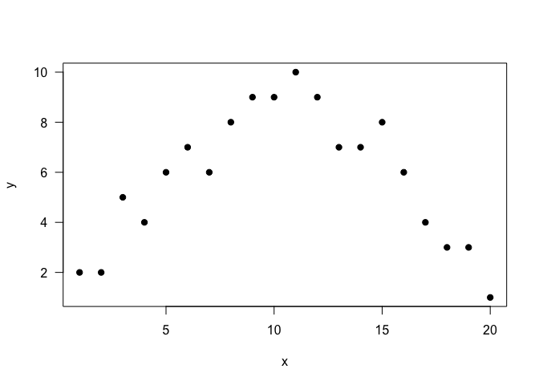
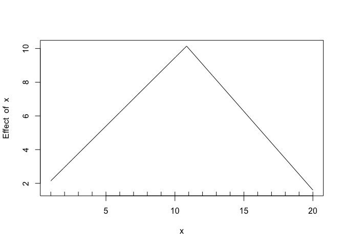
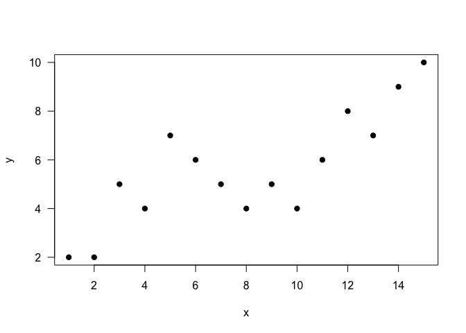
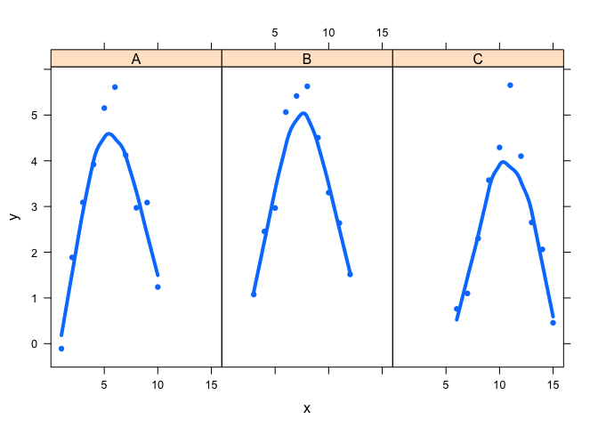

Threshold Coding Tutorial
================
Steve Midway
Spring 2020

### Introduction

Although not an explicit time series model, a type of threshold model
may be useful if you are trying to estimate one or a few points in your
data when a response changes. Note that what I am calling threshold
models are also called *changepoint models*, *breakpoint models*,
*segmented regression*, *piecewise regression*, and the *hockey stick
model*, among other names. There may be differences among these terms;
however, for our purposes these are all the same model. Also note that
what is presented here are not time series models in the sense that they
account for autocorrelated observations. Despite this fact, they may
still be appropriate and useful for analyzing data that takes place over
time.

### Estimating a Single Changepoint

Let’s create a data set that has some obvious trends of dynamics that we
want to see our models capture. Please work with this simulated data,
but feel free to come back to this step and simulate data with different
characteristics to explore. To start, let’s simulate a data set of 20
observations where the first 10 values increase with time and the final
10 values decrease.

``` r
library(data.table)
obs1 <- c(2,2,5,4,6,7,6,8,9,9)
obs2 <- c(10,9,7,7,8,6,4,3,3,1)
y <- c(obs1, obs2)
x <- 1:20
df <- data.table(x,y)
```

And let’s plot to make sure it looks like a series of observations with
a changepoint.

``` r
plot(y ~ x,
     data = df,
     pch = 19, 
     las = 1)
```

<!-- -->

One simple package for estimaing a changepoints is `segmented`. Using
this package, you will save your linear model and then include that
model object into the `segmented()` function, along with the covariate
for which you want to estimate the changepoint and a starting value for
where the function will look for the changepoint.

``` r
library(segmented)
lin.mod <- lm(y~x, data = df)
segmented.mod <- segmented(lin.mod, seg.Z = ~x, psi=10)
```

If everything is running correctly, you should have fit your segmented
regression. You can extract an AIC value (for comparisons, if needed),
and index the segmented object for `psi` to see the changepoint
estimate.

``` r
#AIC(segmented.mod)
segmented.mod$psi
```

    ##        Initial     Est.    St.Err
    ## psi1.x      10 10.84722 0.4257324

Finally, the function `slope()` will print out coefficient information
for the estimated slopes. How are the slopes interpreted?

``` r
slope(segmented.mod)
```

    ## $x
    ##            Est. St.Err.  t value CI(95%).l CI(95%).u
    ## slope1  0.81212 0.09096   8.9284    0.6193   1.00490
    ## slope2 -0.93333 0.09096 -10.2610   -1.1262  -0.74051

There is also a function to plot the segmented model object; however,
you might have more command by simply plotting the data and adding the
regression lines (as segments, unrelated to the model fitting function).

``` r
plot(segmented.mod)
```

<!-- -->

### Estimating Multiple Changepoints

Let’s say we have a data set with three trends and two changepoints. It
might look like this data:

``` r
library(data.table)
y <- c(2,2,5,4,7,6,5,4,5,4,6,8,7,9,10)
x <- 1:15
df2 <- data.table(x,y)
```

And let’s take a look.

``` r
plot(y ~ x,
     data = df2,
     pch = 19, 
     las = 1)
```

<!-- -->

We can use the same machinery in as above, but add a changepoint
estimate to the `psi` argument.

``` r
lin.mod2 <- lm(y~x, data = df2)
segmented.mod2 <- segmented(lin.mod2, seg.Z = ~x, psi=c(5,10))
```

We see that `psi` produces two changepoint estimates.

``` r
segmented.mod2$psi
```

    ##        Initial     Est.    St.Err
    ## psi1.x       5 5.272727 0.6596229
    ## psi2.x      10 8.370370 0.6481275

And `slope()` now gives us all three estimated slope coefficients.

``` r
slope(segmented.mod)
```

    ## $x
    ##            Est. St.Err.  t value CI(95%).l CI(95%).u
    ## slope1  0.81212 0.09096   8.9284    0.6193   1.00490
    ## slope2 -0.93333 0.09096 -10.2610   -1.1262  -0.74051

You are encouraged to check out the package `mcp`, which stands for
multiple changepoints, and is a package that also provides functions for
estimating models with multiple changepoints. Note that `mcp()` can
support generalized linear models.

### Changepoint Parameter as a Random Effect

Perhaps you have a situation where you have a single changepoint, but it
should be treated as a random effect. For example, maybe you have a
phenological dataset where some response increases and then decreases
based on an environmental variable, although each year that
environmental variable (i.e., changepoint) might not occur at the same
exact time. In this example, the general function is conserved, but the
changepoint may shift in its estimate of *x*. You might think of similar
examples were the random effects are related to species, spatial units,
or other classic random effects units.

Let’s simulate data for four groups that each have a shared functional
response, but different chngepoints.

``` r
raw <- c(1,2,3,4,5,5,4,3,2,1)
obs1 <- raw + rnorm(n = 10,mean = 0,sd = 0.5)
obs2 <- raw + rnorm(n = 10,mean = 0,sd = 0.5)
obs3 <- raw + rnorm(n = 10,mean = 0,sd = 0.5)
y <- c(obs1, obs2, obs3)
g <- c(rep("A",10),rep("B",10),rep("C",10))
x <- c(1:10, 3:12, 6:15)
df3 <- data.table(x,y,g)
```

And, of course, a quick visual.

``` r
library(lattice)
xyplot(y ~ x | g, 
       data = df3, 
       type = c("p", "smooth"), 
       lwd = 4,
       pch = 16)
```

<!-- -->

Using the `nlme` library and function, we can write a formula for our
changepoint model with random effects. We can specify what is fixed and
random, but the important part here is to make sure the changepoint can
be random.

``` r
library(nlme)
cp.nlme <- nlme(y ~ b0 + b1 * x + b2 * pmax(0, (x - cp)),
                        data = df3,
                        fixed = b0 + b1 + b2 + cp ~ 1,
                        random = pdDiag(b0 + b1 + b2 + cp ~ 1),
                        groups = ~ g,
                        control = list(msVerbose = TRUE, niterEM = 200,
                                      opt = "nlminb", tol = 1e-5),
                        start = c(b0 = 1, b1 = 1, b2 = -1, cp = 8))
```

    ##   0:     55.677958: 0.531701  4.72338  3.23726 -0.721994
    ##   1:     55.677397: 0.531838  4.73924  3.25510 -0.721941
    ##   2:     55.672806: 0.533084  4.89307  3.42771 -0.721450
    ##   3:     55.665700: 0.535847  5.31159  3.89629 -0.720161
    ##   4:     55.663316: 0.536428  5.61439  4.23459 -0.720526
    ##   5:     55.662092: 0.534388  5.91734  4.57273 -0.716504
    ##   6:     55.661774: 0.540697  6.22016  4.91060 -0.731838
    ##   7:     55.661060: 0.535991  6.49880  5.22137 -0.721263
    ##   8:     55.660886: 0.535129  6.75660  5.50885 -0.719189
    ##   9:     55.660785: 0.535253  7.01440  5.79634 -0.719307
    ##  10:     55.660708: 0.535624  7.37353  6.19679 -0.720045
    ##  11:     55.660675: 0.535738  7.68978  6.54943 -0.720311
    ##  12:     55.660659: 0.535719  8.00604  6.90206 -0.720293
    ##  13:     55.660650: 0.535683  8.32229  7.25469 -0.720223
    ##  14:     55.660646: 0.535669  8.63855  7.60732 -0.720191
    ##  15:     55.660643: 0.535670  8.95481  7.95994 -0.720191
    ##  16:     55.660642: 0.535674  9.27107  8.31257 -0.720198
    ##  17:     55.660642: 0.535676  9.58733  8.66520 -0.720202
    ##  18:     55.660641: 0.535676  9.90358  9.01783 -0.720202
    ##  19:     55.660641: 0.535675  10.2198  9.37046 -0.720201
    ##  20:     55.660641: 0.535675  10.5361  9.72309 -0.720201
    ##  21:     55.660641: 0.535675  10.8524  10.0757 -0.720201
    ##  22:     55.660641: 0.535675  11.1686  10.4283 -0.720201
    ##  23:     55.660641: 0.535675  11.4849  10.7810 -0.720201
    ##  24:     55.660641: 0.535675  11.8011  11.1336 -0.720201
    ##   0:     39.916022: -1.53445  11.8011  11.1336 -1.62784
    ##   1:     39.916022: -1.53445  11.8011  11.1336 -1.62784

``` r
summary(cp.nlme)
```

    ## Nonlinear mixed-effects model fit by maximum likelihood
    ##   Model: y ~ b0 + b1 * x + b2 * pmax(0, (x - cp)) 
    ##  Data: df3 
    ##        AIC      BIC    logLik
    ##   80.93243 93.54321 -31.46622
    ## 
    ## Random effects:
    ##  Formula: list(b0 ~ 1, b1 ~ 1, b2 ~ 1, cp ~ 1)
    ##  Level: g
    ##  Structure: Diagonal
    ##               b0           b1           b2     cp  Residual
    ## StdDev: 1.854641 2.997025e-06 5.842465e-06 2.0362 0.3998147
    ## 
    ## Fixed effects: b0 + b1 + b2 + cp ~ 1 
    ##        Value Std.Error DF    t-value p-value
    ## b0 -2.076898 1.2275180 24  -1.691949  0.1036
    ## b1  0.952983 0.0776587 24  12.271416  0.0000
    ## b2 -1.990955 0.1103583 24 -18.040824  0.0000
    ## cp  7.866776 1.2728169 24   6.180603  0.0000
    ##  Correlation: 
    ##    b0     b1     b2    
    ## b1 -0.337              
    ## b2  0.237 -0.704       
    ## cp  0.022 -0.078  0.000
    ## 
    ## Standardized Within-Group Residuals:
    ##         Min          Q1         Med          Q3         Max 
    ## -1.85425225 -0.77949341  0.05138902  0.65189560  1.85196753 
    ## 
    ## Number of Observations: 30
    ## Number of Groups: 3

The fixed and random effects can be found in the model object.

``` r
cp.nlme$coefficients$random
```

    ## $g
    ##           b0            b1            b2         cp
    ## A  2.0483878  8.092883e-11  2.234603e-10 -2.2573691
    ## B  0.3776638  2.655260e-11  1.363483e-11 -0.4118935
    ## C -2.4260516 -1.074814e-10 -2.370952e-10  2.6692626

There are many, many more libraries, functions, and model for working
with changepoint data. Please do not limit yourself to the above
suggestions, but use them to help gain an understanding of what datasets
they may be useful and applicable for.
